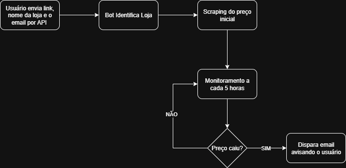

---
### 📂**Estrutura do Projeto**

## 📌 Sobre o Projeto  
Este é um bot desenvolvido em Python que monitora o preço de produtos em lojas específicas a partir de um link fornecido pelo usuário. Utilizando Selenium para automação e scraping, ele verifica periodicamente o valor e, caso haja queda, envia uma notificação por e-mail informando o novo preço.  

O projeto nasceu do meu interesse por automação e evoluiu de um simples teste com Selenium para uma aplicação funcional.
```
src/  
├── Bots/                  # Módulos de scraping para cada loja  
│   ├── amazon.py          # Bot para Amazon  
│   ├── kabum.py          # Bot para Kabum  
│   └── mercadolivre.py    # Bot para Mercado Livre  
├── core/                  # Lógica compartilhada  
│   ├── email.py           # Envio de notificações  
│   └── schedule.py        # Agendamento de verificações   
├── index.py               # Controle principal dos bots  
├── main.py                # API FastAPI  
.env                       # Variáveis de ambiente (e-mail)  
.gitignore  
README.md
```
---
### **🎯Objetivo**
Monitorar produtos em lojas online (Amazon, Kabum, Mercado Livre) e notificar o usuário por e-mail quando o preço baixar.

Regras de Negócio Atuais:
Cada usuário pode monitorar apenas 1 link por vez (diferente da versão inicial, que permitia múltiplos).

O monitoramento encerra automaticamente após a primeira queda de preço.

### ⚙️ Como Funciona
Recebimento do Link:

- O usuário envia um link via API (POST /monitorar).

Scraping Inicial:

- O bot correspondente à loja extrai o preço atual (ex: amazon.py).

Monitoramento Contínuo:

- O sistema verifica o preço a cada 5 horas.

Notificação:

Se o preço baixar, um e-mail é enviado e o monitoramento é interrompido.
---
### **🛠 Tecnologias Utilizadas**
**Tecnologia	Uso	Instalação**
- Python 3.10+	Lógica principal	python.org/downloads
- FastAPI	API para receber links	pip install fastapi
- Beautiful Soup	Scraping estático (HTML)	pip install bs4
- Selenium	Scraping dinâmico (JavaScript*)	pip install selenium
- SMTPLib	Envio de e-mails	Nativo no Python
* Selenium é usado como fallback quando Beautiful Soup não consegue extrair dados.


---
### **🚀 Como Executar**
> Clone o repositório:

```
git clone https://github.com/seu-usuario/monitor-precos.git
```
Configure o ambiente:

> Crie um arquivo .env com:

```
REMETENTE=seu-email@gmail.com  
SENHA=sua-senha-app*
```
* Use Senhas de App do Gmail.

> Instale as dependências:

```
pip install -r requirements.txt
``` 
> Inicie a API:

```
uvicorn main:app --reload
```
---
### **🧠 Dificuldades Encontradas**
1. Primeiro Projeto em Python, aprendizado simultâneo de sintaxe, bibliotecas e boas práticas, dificuldade com tipos e estruturas de dados inicialmente.

2. Mudanças de Regra de Negócio, versão inicial permitia múltiplos links por usuário, mas a complexidade de gerenciamento fez simplificar para 1 link.

3. Scraping Frágil: Lojas alteram classes HTML frequentemente (ex: Amazon mudou a-price-whole 3x em 6 meses).
  **Solução: Implementação de fallback com Selenium para casos críticos.**
   
4. Ausência de Banco de Dados, decisão proposital para simplificar, mas limita persistência após reinícios.

### **🛑 Caso os Bots Parem de Funcionar**
Os bots dependem da estrutura HTML das lojas. Se pararem:

1. Verifique os logs para erros de scraping.

2. Abra uma issue no GitHub ou entre em contato diretamente, atualizarei os seletores conforme necessário.

---
### **📝 Notas Adicionais**
Threads em Background: O monitoramento roda em threads separadas para não bloquear a API.

Limitações:

- Sem autenticação de usuários (qualquer e-mail pode ser usado).

- Dados são perdidos se o servidor for reiniciado.

Contribuições são bem-vindas! 👨‍💻

